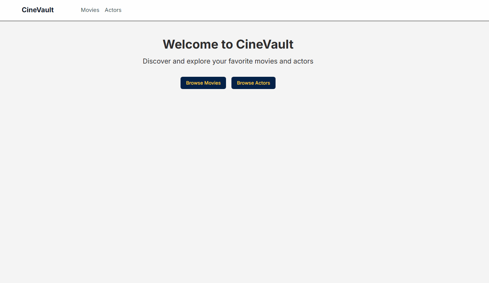

# CineVault
A web application built with Next.js, TailwindCSS, for users to manage a list of movies and actors.



## :speech_balloon: Description
This project contains all the files for a web application called CineVault.

### Backend
* /auth/signup and /auth/signin post endpoints to handle user creation and session. 
* /movies route with post, get, put and delete endpoints to handle movies (including actors featured).
* /actors route with post, get, put and delete endpoints to handle actors.
* /ratings route with post, get, put and delete endpoints to handle movie ratings.

### Frontend
* Home page and header with links for actors and movies pages
* Actors list with option to search by partial name
* Movies list with option to search
* Actor detail page with list of participated movies
* Movie detail page with featured actors and ratings
* URL-driven state - easily shareable with others

## ✨ Tech  
* [Next.js](https://nextjs.org/) as the React framework for SSR and routing.  
* [Tailwind CSS](https://tailwindcss.com/) for styling with utility-first classes.  
* [NestJS](https://nestjs.com/) for building a modular and scalable backend architecture.  
* [TypeORM](https://typeorm.io/) as the ORM for interacting with the database using TypeScript.  
* [PostgreSQL](https://www.postgresql.org/) for robust and relational data storage.  

## :computer: Usage
To run the project locally you need:
```
Node.js >= 22
pnpm
A running Postgres database

OR

Docker
```

* Clone or download the repository.
* You can follow the steps to run the project using Node.js, or you can check how to use Docker on the Docker Support section.

#### Backend

* Access the [backend directory](./backend).
* Set a .env file using the [.env.example](./backend/.env.example) as model. Avoid port 5000 since it's the default used by the frontend. The API_KEY is used to override the JWT token in the create, put and delete endpoints.
* Open a terminal in the [backend directory](./backend).
* Setup the database (only the first time running):
```bash
pnpm run migration:run
pnpm run seed

```
* Finally, run the following commands:

```bash
pnpm install
pnpm run start
```
* You can now make the requests. Check the Routes section for details.

#### Frontend
* Access the [frontend directory](./frontend).
* Set a .env file using the [.env.example](./frontend/.env.example) as model.
* Open a terminal in the [backend directory](./backend).
* Run the following commands:
```bash
pnpm install
pnpm run dev
```
* You can now access `http://localhost:5000/` and navigate the page. Check the Navigation section for details.

## :whale: Docker support
* To run the application with Docker, first set a .env file using the [.env.example](./.env.example) as model. The API_KEY is used to override the JWT token in the create, put and delete endpoints.
* In the [frontend directory](./frontend), open [next.config.ts](./frontend/next.config.ts) and uncomment line 5:
```
output: "standalone",
```
* Open a terminal in the root and run `docker compose up` command.
* Wait for the build and all projects to start, last one is the backend.
* You can access the backend in ```http://localhost:4000/swagger```. Check the Routes section for details.
* You can access the frontend in ```http://localhost:3000/```. Check the Navigation section for details.

## :world_map: Routes
All the routes are documented on [SwaggerHub](https://app.swaggerhub.com/apis-docs/MARVINSD/CineVault/1.0). Swagger is also available in the project, you can use it to make the requests accessing `http://localhost:port/swagger`. 

Make sure to have the API_KEY or the jwt token (acquired with ```auth/signup``` and ```auth/signin```) in your request as a [bearer authentication](https://swagger.io/docs/specification/v3_0/authentication/bearer-authentication/). You can also configure it in swagger using the lock icon in the right.

## :world_map: Navigation  
* On the home page, you can click one of the buttons or use the navbar to navigate to the Movies or Actors page.  
* On each page, you'll see a list of available actors or movies. You can navigate through pages or use the search bar.  
* Clicking an actor or movie redirects you to a page with more details.  
* On the actor page, clicking one of the listed movies will take you to that movie’s detail page.  
* On the movie page, clicking one of the featured actors will take you to that actor’s detail page.

## :pushpin: Next steps
### Backend
* Implement query dto to validate user input
* Refactor TypeORM into a dedicated repository layer to decouple it from the service layer
* Refactor error treatment away from the service layer
* Use dedicated Passport module to handle auth instead of Guard.
* Implement rate limitting
* Sanitize user input to add more protection against Stored XSS (Cross-Site Scripting)
* Include more security (express helmet is an option)
* Improve tests and coverage

### Frontend
* Implement signin/signup user flow
* Implement user flow to create/update/delete actors, movies and ratings
* Improve design system
* Improve accessability with ARIA labels
* Improve feedback with better loading indicators
* Improve tests and coverage


## :bulb: Contributing
This project is currently not open for contributions. However, you are welcome to fork the repository and make modifications for personal use.

## :memo: License
This project is released under the MIT License.

## :books: Credits
This project was created as a technical challenge by Marcus Dantas.
